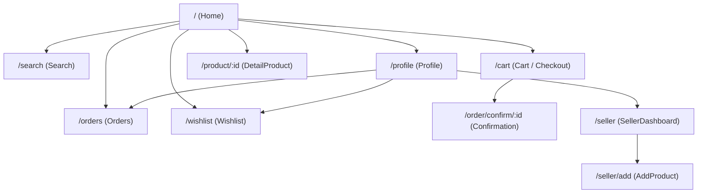
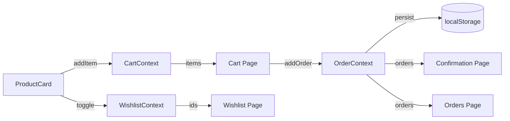
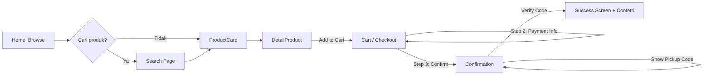
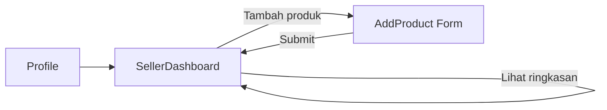

# LastBite — Design Document

**LastBite** adalah aplikasi mobile food surplus marketplace yang menghubungkan penjual (mitra) dengan pembeli untuk menekan food waste. Dikembangkan untuk tugas mata kuliah Interaksi Manusia dan Komputer — Departemen Informatika UNDIP 2026.

---

## 1. Design Philosophy & Prinsip

### Visi
Mengubah makanan surplus yang biasanya terbuang menjadi solusi ekonomi yang menguntungkan semua pihak.

### Prinsip Desain
| Prinsip | Penerapan |
|---------|-----------|
| **Transparansi** | Setiap produk menampilkan jam produksi, batas konsumsi, dan label higienis |
| **Kepercayaan** | Verifikasi mitra, label "Higienis A+", dan jaminan kualitas |
| **Kemudahan** | Alur browse -> beli -> ambil dalam 3 langkah |
| **Dampak** | Setiap transaksi menampilkan metrics penghematan dan food saved |

### Target Pengguna
- **Pembeli**: Mahasiswa/karyawan dengan budget terbatas, peduli food waste
- **Penjual (Mitra)**: Toko makanan kecil-menengah dengan stok surplus harian

---

## 2. Design System

### 2.1 Color Tokens (CSS Custom Properties)

Semua warna didefinisikan sebagai CSS custom properties di `src/styles/theme.css`.

```css
:root {
  --background: #e4dcca;     /* Warna dasar halaman */
  --primary: #11676a;        /* Teal gelap — aksi utama, header */
  --primary-foreground: #ffffff;
  --secondary: #dda63a;      /* Emas — harga diskon, aksen */
  --secondary-foreground: #030213;
  --destructive: #c2382e;    /* Merah — stok habis, error */
  --muted: #ececf0;
  --card: #ffffff;
  --border: rgba(0, 0, 0, 0.1);
}
```

| Peran | Warna | Hex | Penggunaan |
|-------|-------|-----|------------|
| Primary | Teal | `#11676a` | Header, tombol utama, nav aktif |
| Secondary | Emas | `#dda63a` | Harga diskon, badge, aksen |
| Background | Krem | `#e4dcca` | Latar halaman |
| Destructive | Merah | `#c2382e` | Stok habis, error, persentase diskon |
| Card | Putih | `#ffffff` | Kartu produk, modal, sheet |

### 2.2 Tipografi

- **Font dasar**: System UI (tanpa custom font — menggunakan sistem default)
- **Ukuran font base**: `16px`
- **Heading**: `font-weight-medium`, line-height 1.5
- **Label/Button**: `font-weight-medium`
- **Input**: `font-weight-normal`

### 2.3 Spacing & Radius

| Token | Value |
|-------|-------|
| `--radius` | `0.625rem` (10px) |
| `--radius-xl` | `calc(var(--radius) + 4px)` = 14px |
| Padding standar card | `1rem` (16px) |
| Gap standar | `0.75rem - 1rem` |
| Container max-width | `28rem` (md breakpoint, disimulasikan dengan `max-w-md mx-auto`) |

### 2.4 Shadow

Kartu produk dan modal menggunakan `shadow-md` Tailwind. Bottom CTA menggunakan shadow eksplisit:
```css
shadow-[0_10px_25px_-5px_rgba(0,0,0,0.1)]
```

---

## 3. Information Architecture

### 3.1 Route Tree



### 3.2 Layout Structure

```
MainLayout (max-w-md, centered, mobile-first)
├── <Header />                    (sticky, primary bg)
│   └── Logo + Lokasi + Badge
├── <Outlet />                    (scrollable content)
│   └── [Page Component]
└── <BottomNav />                 (fixed bottom, 4 tabs: Beranda, Cari, Keranjang, Profil)
```

- **SellerDashboard** dan **AddProduct** menggunakan layout sendiri (full-screen, tidak pakai MainLayout)
- Semua halaman lain dirender di dalam `MainLayout`

### 3.3 Navigasi

**Bottom Navigation (4 tabs):**
| Icon | Label | Route | 
|------|-------|-------|
| Home | Beranda | `/` |
| Search | Cari | `/search` |
| ShoppingBag | Keranjang | `/cart` |
| User | Profil | `/profile` |

**Navigasi sekunder:**
- Tombol "Kembali" (ChevronLeft) di halaman detail, seller, orders
- Tombol "Lihat Detail" di kartu produk
- Tombol "Cari Makanan" di empty state
- Links dari Profil ke Orders, Wishlist, Seller

---

## 4. Data Model (TypeScript Interfaces)

### 4.1 Product

```typescript
interface Product {
  id: number;
  name: string;            // "Ayam Preksu"
  store: string;           // "Preksu Geprek"
  originalPrice: number;   // 16000
  discountedPrice: number; // 8000
  discount: number;        // 50 (persen)
  expiresIn: string;       // "2 jam"
  remaining: number;       // sisa porsi
  distance: string;        // "120m" atau "1.2km"
  category: string;        // "meals" | "bakery" | "drinks"
  image: string;           // URL atau path lokal
}
```

**Kategori yang tersedia:** `all` (semua), `meals` (Makanan), `bakery` (Roti), `drinks` (Minuman)

Data produk bersifat **statis** dari `src/app/data/products.ts` (8 item dummy).

### 4.2 CartItem

```typescript
interface CartItem {
  id: number;
  name: string;
  store: string;
  price: number;           // harga diskon saat dimasukkan
  originalPrice: number;
  image: string;
  quantity: number;        // >= 1, <= stok tersisa
}
```

**Aturan bisnis Cart:**
- Hanya bisa berisi produk dari **1 toko** (single-store cart). Mirip GoFood/Shopee Food.
- Jika user menambahkan produk dari toko lain, muncul konfirmasi: "Hapus dan ganti?"
- Quantity dibatasi oleh `product.remaining` (stok maksimal)

### 4.3 Order

```typescript
interface Order {
  id: string;              // "ord-" + UUID atau timestamp
  items: OrderItem[];      // snapshot dari CartItem
  total: number;
  paymentMethod: string;   // selalu "cod"
  name: string;            // nama pemesan
  phone: string;
  timestamp: number;       // Date.now()
  status: 'pending-pickup' | 'picked-up';
  pickupCode: string;      // "LAST-" + 4 digit random
}
```

### 4.4 Wishlist

```typescript
// Wishlist hanya menyimpan array of product IDs
interface WishlistState {
  ids: number[];
}
```

---

## 5. State Management

### 5.1 Context Architecture

```
App
├── CartProvider (useReducer)
│   └── State: CartItem[]
│   └── Actions: ADD_ITEM, REMOVE_ITEM, UPDATE_QUANTITY, CLEAR_CART
│   └── Derived: itemCount, subtotal, currentStore
├── WishlistProvider (useReducer)
│   └── State: number[] (product IDs)
│   └── Actions: TOGGLE, CLEAR
│   └── Derived: count, isWishlisted(id)
└── OrderProvider (useReducer)
    └── State: Order[]
    └── Actions: ADD_ORDER, SET_STATUS
    └── Persistence: localStorage (key: "lastbite-orders", TTL: 24 jam)
    └── Derived: pendingOrders, pendingCount
```

### 5.2 Data Flow Diagram



### 5.3 Persistence Strategy

| Data | Storage | Key | TTL |
|------|---------|-----|-----|
| Cart | In-memory (useReducer) | — | Session |
| Wishlist | In-memory (useReducer) | — | Session |
| Orders | localStorage | `lastbite-orders` | 24 jam |
| Seller products | localStorage | `lastbite-seller-products` | Permanen |

Order persistence memiliki **validasi ketat**: setiap item dan order divalidasi tipenya saat load dari localStorage. Jika ada field yang tidak sesuai tipenya, item/order tersebut akan difilter (graceful degradation).

---

## 6. Component Tree & Hierarchy

### 6.1 Page-to-Component Mapping

| Page | Components Used |
|------|----------------|
| **Home** | Header, SearchBar, AIRecommendation, CategoryFilter, FilterBar, ProductGrid, ProductCard |
| **Search** | SearchBar (inline), ProductCard |
| **DetailProduct** | QueueIndicator, AIRecommendation, MapModal |
| **Cart** | (Inline: step indicator, cart items, payment form, confirmation) |
| **Confirmation** | QueueIndicator |
| **Orders** | (List card) |
| **Profile** | (Menu list) |
| **Wishlist** | ProductCard, WishlistItem |
| **SellerDashboard** | (Card list) |
| **AddProduct** | Input, Textarea |

### 6.2 Shared Components

```
src/app/components/
├── AIRecommendation.tsx    # Rekomendasi produk dengan scoring (category, discount, popularity)
├── BottomNav.tsx           # Bottom navigation (4 tabs)
├── CategoryFilter.tsx      # Filter kategori horizontal (Semua, Makanan, Roti, Minuman)
├── FilterBar.tsx           # Sort & filter bar
├── FilterModal.tsx         # Bottom sheet filter (jarak, harga, kedaluwarsa)
├── Header.tsx              # App header (logo, lokasi, badge hemat)
├── MapModal.tsx            # Bottom sheet peta (mock map image)
├── ProductCard.tsx         # Kartu produk (image, info, add-to-cart + wishlist)
├── ProductGrid.tsx         # Grid produk dengan filter/sort logic
├── QueueIndicator.tsx      # Live antrean dengan simulasi interval 8-15 detik
├── SearchBar.tsx           # Input pencarian
├── ui/
│   ├── input.tsx           # shadcn Input
│   └── textarea.tsx        # shadcn Textarea
└── figma/                  # Komponen hasil Figma Make (unused?)
```

### 6.3 Component Interaction Rules

- **ProductCard** dapat menambahkan ke Cart dan Wishlist tanpa navigasi
- **AIRecommendation** bersifat opsional — hanya muncul jika ada produk relevan
- **QueueIndicator** menggunakan `setInterval` untuk simulasi real-time (8-15 detik random)
- **FilterModal** dan **MapModal** menggunakan AnimatePresence untuk bottom sheet transition

---

## 7. User Flows

### 7.1 Buyer: Browse to Pickup



**Alur detail Checkout (3 step):**
1. **Keranjang** — review item, ubah quantity, lihat ringkasan harga
2. **Pembayaran** — isi nama, telepon, catatan (COD default)
3. **Konfirmasi** — review ulang + konfirmasi pesanan

### 7.2 Seller: Add Product Flow



### 7.3 Pickup Verification Flow

```
Order Confirmed (pending-pickup)
  -> User datang ke toko
  -> Masukkan kode pickup (format: LAST-XXXX)
  -> Sistem verifikasi kode
  -> Status berubah menjadi "picked-up"
  -> Tampilkan success screen + confetti animation
```

---

## 8. Interaction & Micro-interactions

### 8.1 Page Transitions

- **AnimatePresence** dengan `mode="wait"` untuk transisi step checkout
- Keyframe: `{ opacity: 0, x: 20 } -> { opacity: 1, x: 0 }` (200ms)
- **motion.div** initial/animate/exit untuk bottom sheet modal

### 8.2 Component Animations

| Component | Animation | Detail |
|-----------|-----------|--------|
| ProductCard | Fade in + slide up | `initial={{ opacity: 0, y: 20 }}` |
| ProductCard (hover) | Scale + shadow | `hover:-translate-y-0.5 hover:shadow-xl` |
| QueueIndicator number | Scale pop | `key={currentQueue}` + scale animation |
| Add to Cart button | Scale on tap | `whileTap={{ scale: 0.95 }}` |
| Confirmation icon | Spring scale | `initial={{ scale: 0 }}` -> `scale: 1` |
| Bottom sheet | Slide up spring | `y: '100%' -> y: 0`, damping 25 |
| Reviews | Stagger fade in | Per-item `initial={{ opacity: 0, y: 10 }}` |

### 8.3 Feedback & Error Handling

| Situasi | Feedback |
|---------|----------|
| Add to cart berhasil | Tombol berubah "Ditambahkan!" (2 detik) |
| Stok habis | Tombol disabled "Stok Habis" |
| Quantity maksimum | Tombol "+" disabled + teks "Stok maks. tercapai" |
| Cart dari toko berbeda | Confirm dialog "Hapus dan ganti?" |
| Produk tidak ditemukan | Halaman "Produk tidak ditemukan" |
| Kode pickup salah | Error message merah di bawah input |
| Waktu pickup habis | Timer menampilkan "Waktu habis!" |
| Pesanan tidak ditemukan | Halaman "Pesanan tidak ditemukan" |
| Gambar gagal load | Fallback icon + nama produk |
| Checkout tanpa nama | Tombol disabled sampai nama diisi |
| Empty cart/wishlist | Ilustrasi + tombol "Cari Makanan" |

### 8.4 Confetti Effect

Saat pickup berhasil, `canvas-confetti` dipicu selama 3 detik dengan warna brand:
```
colors: ['#0f766e', '#d97706', '#10b981', '#fbbf24']
```

### 8.5 AI Recommendation Engine

Rekomendasi menggunakan **scoring system deterministik** dengan 3 faktor:

| Faktor | Bobot | Logika |
|--------|-------|--------|
| Category Match | 0-40 | Produk sekategori: 35-40, beda kategori: 10-20 |
| Discount Value | 0-30 | `min(30, discount * 0.6)` |
| Popularity | 0-30 | Stok <=3: 25-30, <=7: 15-24, >7: 5-14 |

- Hasil ditampilkan sebagai "X% cocok" dengan breakdown tooltip
- Scoring bersifat pseudo-random (deterministik dari seed) untuk stabilitas
- Tidak ada API eksternal — murni frontend logic

---

## 9. Usability Findings & Iterasi

Berdasarkan pengujian dengan 11 responden (17 Mei 2026):

### 9.1 SUS Score

| Metric | Score | Kategori |
|--------|-------|----------|
| SUS Mean | **69.8** | Acceptable (tepat di bawah Good/70) |
| Tertinggi | 85.0 | Excellent |
| Terendah | 60.0 | Acceptable |

### 9.2 Dimensi yang Diuji

| Aspek | Rata-rata (1-5) |
|-------|-----------------|
| Kemudahan temukan produk surplus | 4.27 |
| Kemudahan proses pemesanan | 4.36 |
| Keyakinan kualitas makanan | **3.27** (terendah) |

### 9.3 Masalah yang Teridentifikasi

| Masalah | Dampak | Prioritas |
|---------|--------|-----------|
| Tombol tidak terlihat tapi bisa diklik | Bingung, frustrasi | HIGH |
| Navigation bar hilang saat scroll | Kesulitan navigasi | HIGH |
| Alur checkout membingungkan | Drop-off | MEDIUM |
| Foto produk kurang realistis | Kurang percaya | MEDIUM |
| Keyakinan kualitas rendah (3.27/5) | Tidak jadi beli | HIGH |

### 9.4 Fitur yang Diminta Responden

1. Antrean real-time otomatis (sudah ada QueueIndicator dengan simulasi)
2. Pencarian berdasarkan toko/lokasi
3. Filter harga, jarak, estimasi waktu (sudah ada FilterBar + FilterModal)
4. Integrasi maps informatif (sudah ada MapModal)
5. Wishlist untuk stok habis (sudah ada WishlistContext)
6. Perbaikan alur checkout

### 9.5 Catatan untuk Iterasi Selanjutnya

- Meningkatkan kepercayaan melalui foto produk realistis dan sertifikasi yang lebih jelas
- Memperbaiki visibility tombol yang "ghost clickable"
- Memastikan BottomNav sticky di semua kondisi scroll
- Menyederhanakan alur checkout (3 step -> 2 step?)
- Menambahkan foto real instead of ilustrasi untuk produk

---

## 10. Technical Architecture

### 10.1 Tech Stack

| Layer | Teknologi |
|-------|-----------|
| Framework | React 18 + TypeScript |
| Bundler | Vite 6 |
| CSS | Tailwind CSS 4 + PostCSS |
| UI Library | shadcn/ui (Radix primitives) + Material UI 7 |
| Routing | React Router 7 |
| Animation | motion (framer-motion v12) |
| State | useReducer + Context |
| Form | react-hook-form (tersedia di package.json) |

### 10.2 Project Structure

```
src/
├── main.tsx                       # Entry point
├── styles/
│   ├── index.css                  # Import aggregator
│   ├── tailwind.css               # Tailwind directives
│   ├── theme.css                  # Design tokens & CSS variables
│   └── fonts.css                  # Font imports
└── app/
    ├── App.tsx                    # Root component (providers wrapper)
    ├── routes.tsx                 # Router configuration
    ├── data/
    │   └── products.ts            # Static product data (8 items)
    ├── context/
    │   ├── CartContext.tsx         # Cart state + reducer
    │   ├── WishlistContext.tsx     # Wishlist toggle
    │   └── OrderContext.tsx        # Order management + localStorage
    ├── layouts/
    │   └── MainLayout.tsx         # App shell (Header + BottomNav + Outlet)
    ├── pages/
    │   ├── Home.tsx               # Browse produk
    │   ├── Search.tsx             # Pencarian + trending
    │   ├── Cart.tsx               # Checkout 3-step
    │   ├── DetailProduct.tsx      # Detail + review + CTA
    │   ├── Confirmation.tsx       # Pickup code + timer + success
    │   ├── Orders.tsx             # Riwayat pesanan
    │   ├── Profile.tsx            # Profil + menu
    │   ├── Wishlist.tsx           # Favorit + notifikasi stok
    │   ├── SellerDashboard.tsx    # Dashboard mitra
    │   └── AddProduct.tsx         # Form tambah produk
    └── components/
        ├── Header.tsx, BottomNav.tsx
        ├── ProductCard.tsx, ProductGrid.tsx
        ├── CategoryFilter.tsx, FilterBar.tsx, FilterModal.tsx
        ├── SearchBar.tsx, AIRecommendation.tsx
        ├── QueueIndicator.tsx, MapModal.tsx
        └── ui/ (shadcn primitives)
```

---

## 11. Responsive Design

Aplikasi di-desain **mobile-first** dengan constraint:

- Max width container: `max-w-md` (28rem / 448px) — simulasi layar HP
- Center alignment: `mx-auto`
- Full height: `min-h-[100dvh]`
- Safe area: `pb-[env(safe-area-inset-bottom,0px)]`
- BottomNav fixed dengan shadow
- Content area: `flex-1 overflow-y-auto`

---

## 12. Daftar Istilah (Glossary)

| Istilah | Definisi |
|---------|----------|
| **Makanan Surplus** | Makanan sisa stok yang masih layak konsumsi, dijual dengan harga diskon |
| **Mitra** | Penjual/toko yang mendaftar di LastBite |
| **Food Saver** | Pembeli yang aktif menyelamatkan makanan surplus (gamification) |
| **Kode Pickup** | Kode unik format `LAST-XXXX` untuk verifikasi pengambilan pesanan |
| **Pesanan** | Order yang sudah dikonfirmasi, memiliki status `pending-pickup` atau `picked-up` |
| **Ongoing Payment** | Jumlah pembeli yang sedang dalam proses checkout di toko yang sama |
| **Makanan Diselamatkan** | Metrics dampak: jumlah porsi makanan yang dibeli (mencegah food waste) |
